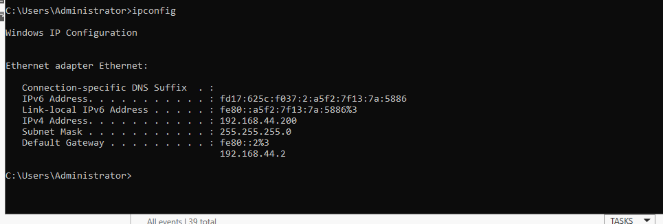
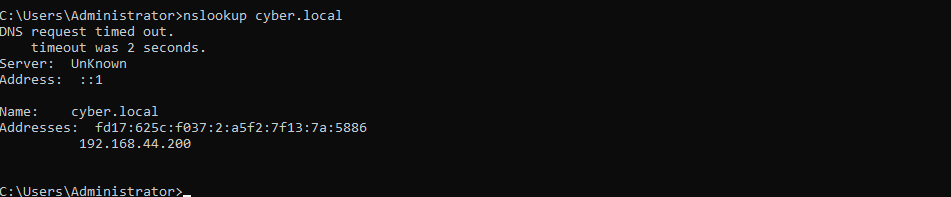
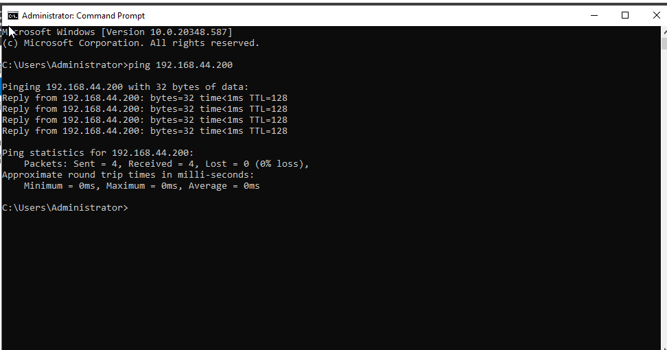

# Lab 02: Windows 10 Workstation Domain Join

## 🎯 Objective
Establish a secure trust relationship between a Windows 10 endpoint and the `cyber.local` Domain Controller to enable centralized Identity and Access Management (IAM).

## 🛠 Technical Steps
| Task | Details |
| :--- | :--- |
| **DNS Configuration** | Pointed client DNS to `192.168.44.200` to resolve the `cyber.local` forest. |
| **Domain Join** | Transitioned machine from "WORKGROUP" to the `cyber.local` domain. |
| **Authentication** | Validated trust via Domain Administrator credentials. |
| **Verification** | Successful interactive login using a network-based profile (`CYBER\Administrator`). |

## 📸 Proof of Work

### 1. Domain Join Success
Click the image to view the full resolution.

### 2. System Verification

### 3. Network Diagnostics (DNS & Connectivity)
| IP Config | NSLookup | Ping Test |
| :--- | :--- | :--- |
|  |  |  |
