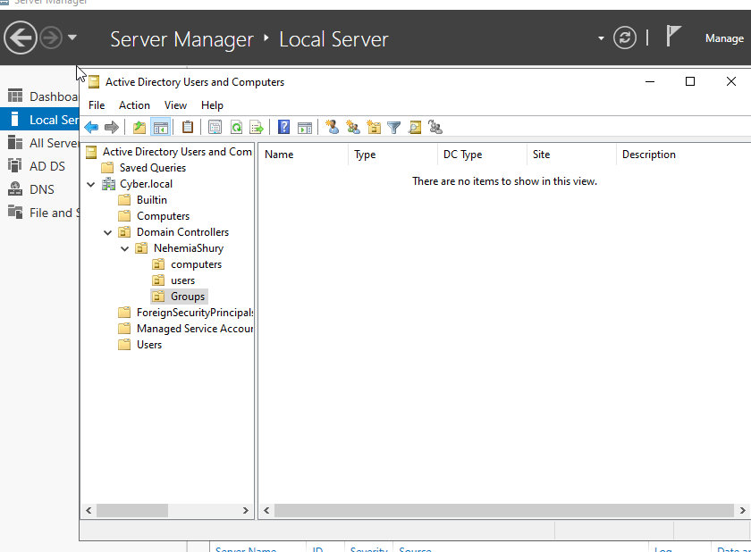
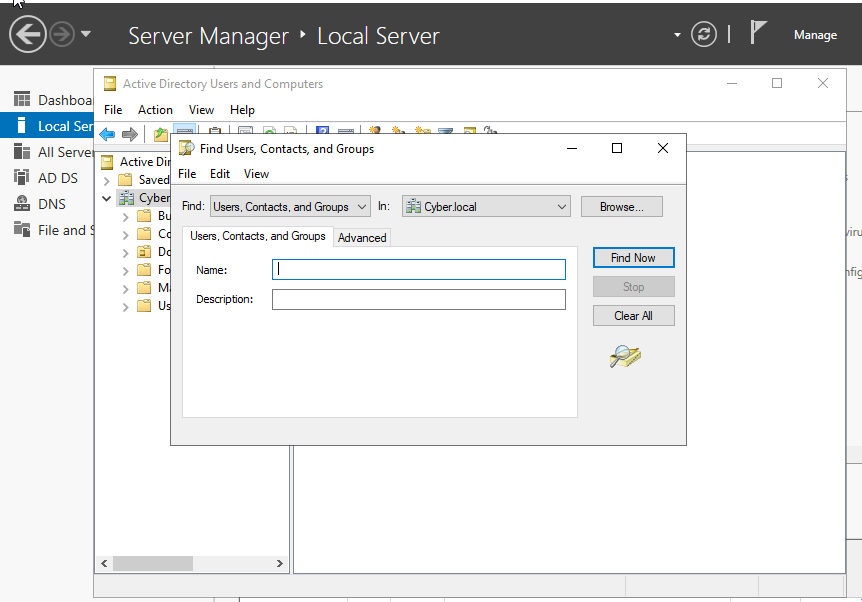
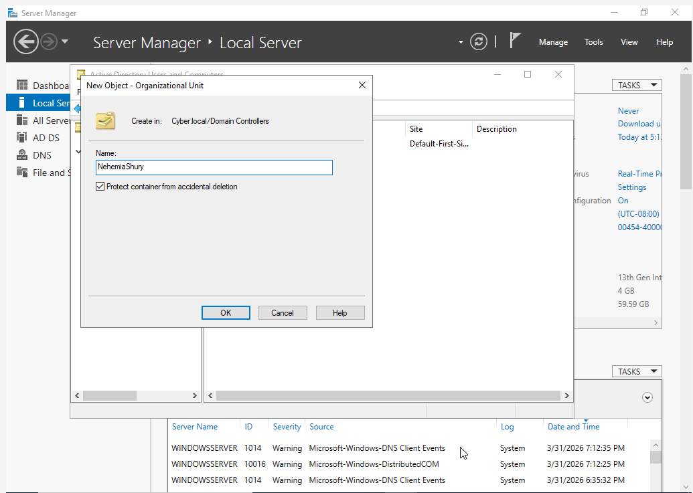
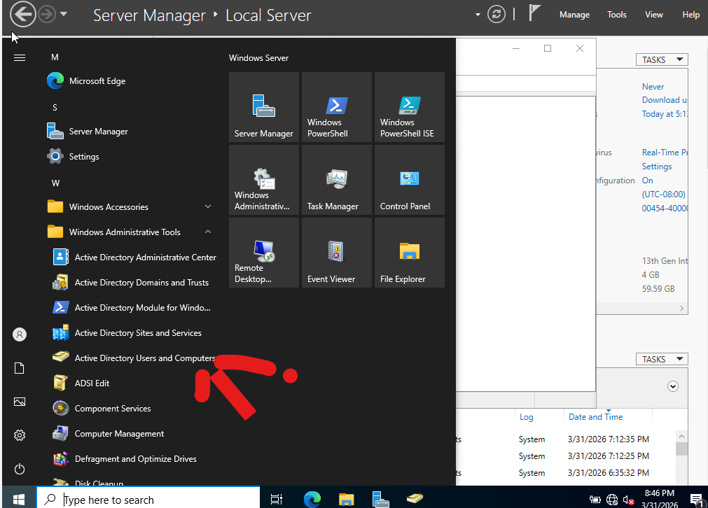

# Lab 03: Administrative Security & OU Hierarchy

## 🎯 Objective
Implement an organized Directory Services hierarchy to facilitate **Identity Governance** and **Role-Based Access Control (RBAC)**.

## 🛠 Technical Implementation
* **Administrative Security:** Performed a mandatory password reset for the Domain Admin account to ensure credential integrity.
* **OU Architecture:** Designed and deployed a nested Organizational Unit (OU) structure within the `IAM Class` container.
* **Hierarchy Design:**
    * `IAM Class` (Parent)
        * `Nehemia Shury` (User Container)
            * `Users`
            * `Groups`
            * `Computers`

## ⚖️ GRC Connection
This structure aligns with **NIST 800-53 (AC-2)** for Account Management. By separating users, groups, and computers, we enable more granular **Group Policy Object (GPO)** application, ensuring that security settings only apply to the intended objects (Principle of Least Privilege).

## 📸 Proof of Work

### 1. OU Hierarchy Design
This screenshot validates the creation of the `Users`, `Groups`, and `Computers` nested OUs.

### 2. Administrative Controls
| Find Admin User | OU Properties |
| :--- | :--- |
|  |  |

### 3. Active Directory Management View
