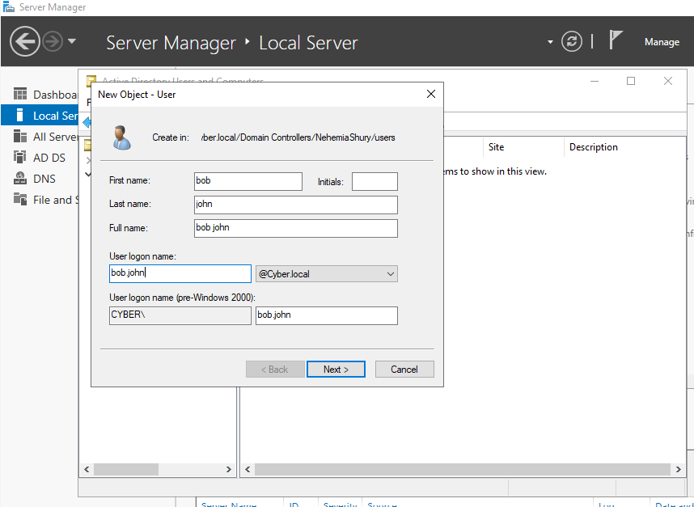
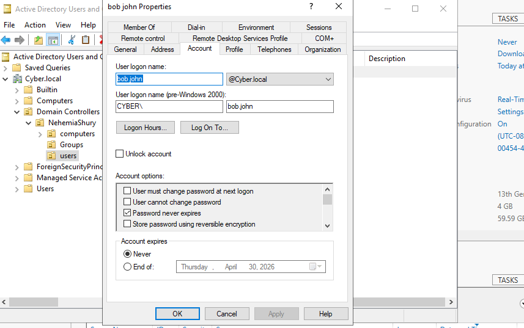
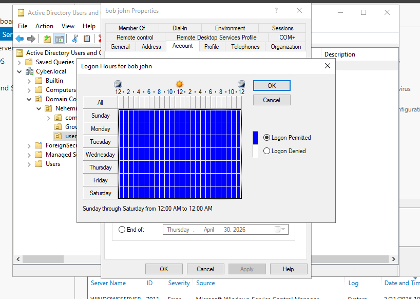

# Lab 04: Identity Attribute Management & Access Governance

## 🎯 Objective
To implement granular Identity Attribute management and establish time-bound access controls to satisfy security and compliance requirements.

## 🛠 Technical Implementation
* **Identity Enrichment:** Populated high-fidelity metadata (Department, Office, Manager) to support future Attribute-Based Access Control (ABAC).
* **Time-Based Access:** Configured **Logon Hours** to restrict interactive logins to authorized business shifts, reducing the attack surface during off-hours.
* **Lifecycle Governance:** Implemented **Account Expiration** dates to mitigate the risk of "Orphaned Accounts" for temporary or contract-based identities.

## ⚖️ GRC & Security Connection
* **NIST 800-53 (AC-2):** Directly addresses Account Management by ensuring accounts have a defined lifecycle and specific operational periods.
* **Audit Trail:** Rich attribute data ensures that security logs provide clear context (Who, What, Where) during an incident response investigation.

## 📸 Proof of Work

### 1. Identity Provisioning & Enrichment
Validating the creation of the user account and the population of professional attributes (Job Title, Office, Department) to support future RBAC.

| New User Creation | Identity Enrichment |
| :--- | :--- |
|  |  |

### 2. Access Governance (Logon Hours)
Implementing time-based restrictions to enforce business-hours-only access, reducing the lateral movement risk during off-hours.

