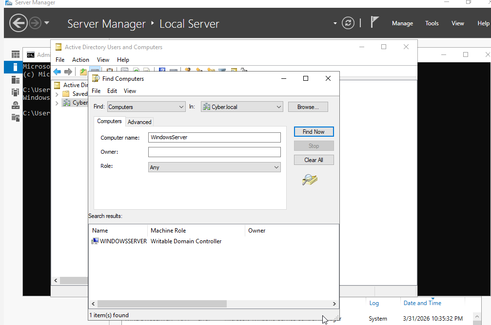
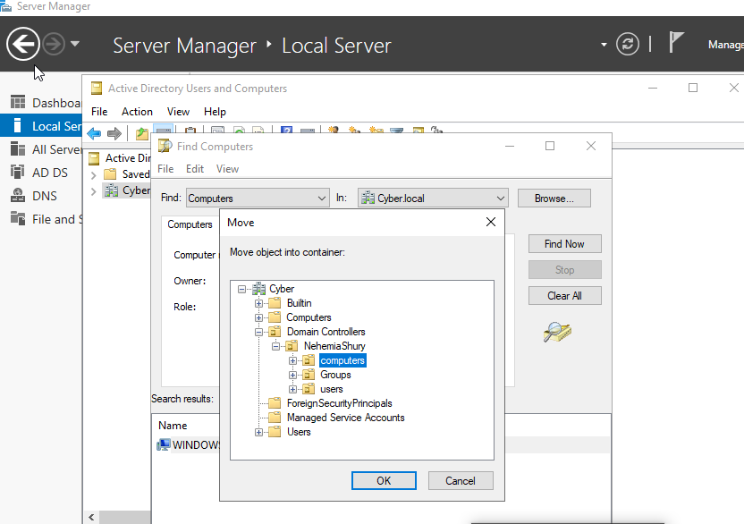
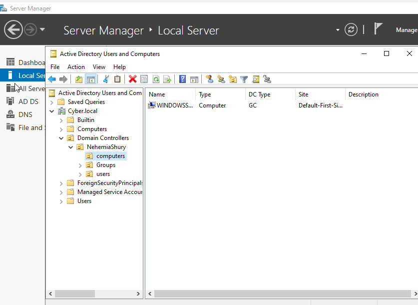
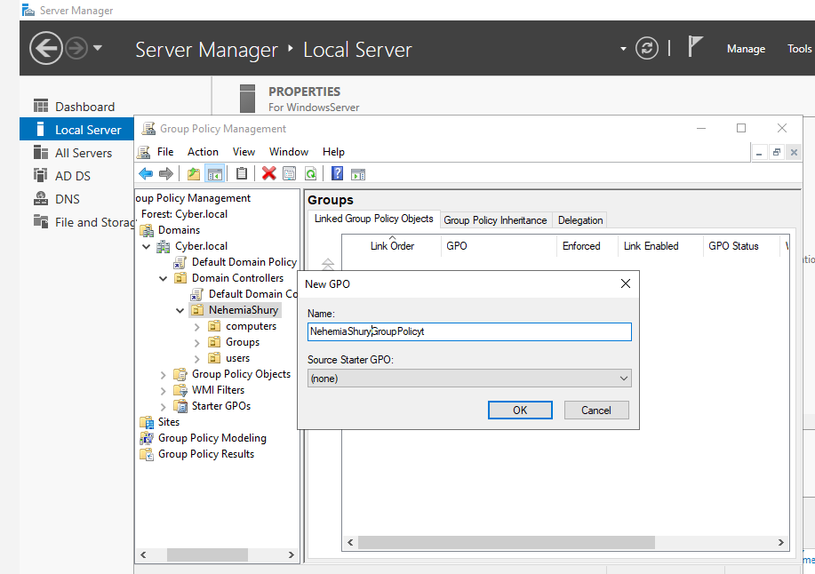
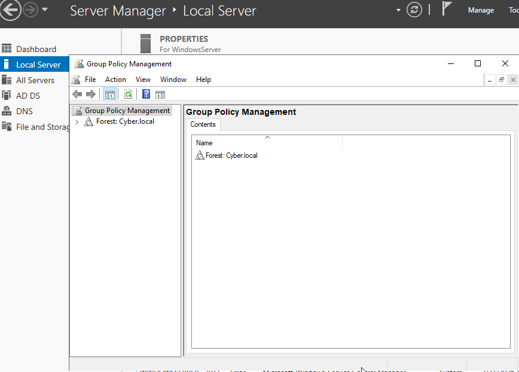
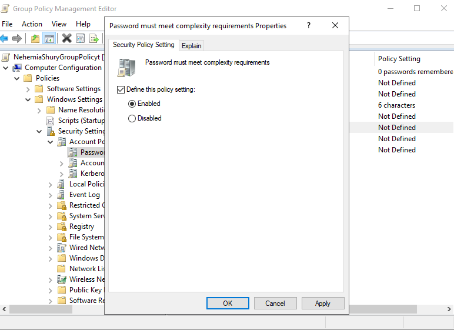
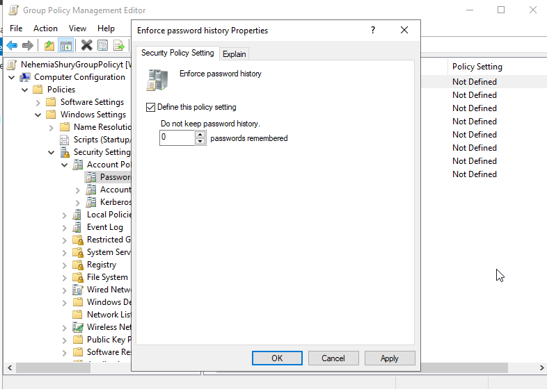
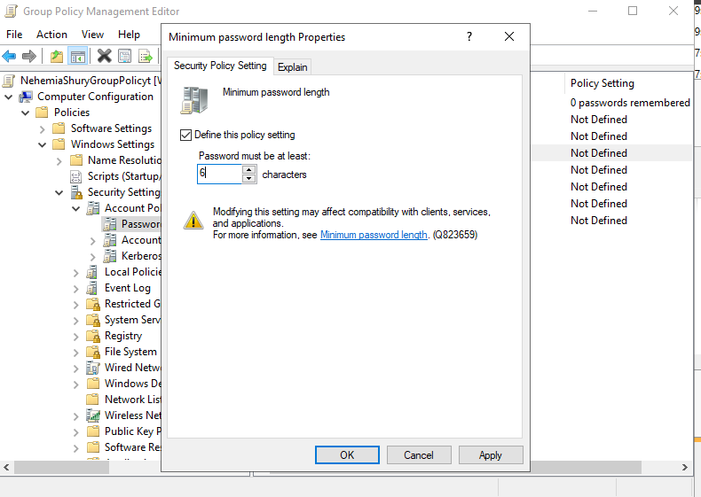

# Lab 05: Password Policy Enforcement via GPO

## 🎯 Objective
To implement automated security governance by enforcing password complexity and length requirements across a domain using Group Policy Objects (GPOs).

## 🛠 Technical Implementation
* **Object Migration:** Realigned the workstation asset into the managed `Computers` Organizational Unit to ensure proper policy inheritance.
* **GPO Architecture:** Designed and linked a custom Group Policy Object (GPO) to the IAM container, targeting the `Account Policies` node.
* **Control Baseline:** * Minimum Length: 6 Characters.
    * History: 0 (Disabled for lab environment).
    * Complexity: Disabled (to validate length-only enforcement).
* **Validation:** Verified policy application via `gpupdate /force` and performed a negative test by attempting to set a non-compliant 4-character password.

## ⚖️ GRC & Security Connection
* **NIST 800-53 (IA-5):** Specifically addresses Authenticator Management. This lab demonstrates the technical enforcement of "Password Quality" requirements defined in a corporate security policy.
* **Governance Automation:** Moves the organization from "Manual Compliance" (asking users to be secure) to "Technical Enforcement" (forcing the system to be secure).

## 📸 Proof of Work

### 1. Target Discovery & Migration
First, I identified the workstation hostname and moved the object into the managed `Computers` Organizational Unit to ensure policy inheritance.

| Hostname Identification | OU Migration Selection |
| :--- | :--- |
|  |  |

> **Audit Evidence:** Workstation successfully migrated to `IAM Class > Computers`.
> 

### 2. Policy Creation & Management
Linking the security policy to the container and ensuring it is enforced across the domain.

| GPO Creation | GPO Management View |
| :--- | :--- |
|  |  |

### 3. Technical Controls (Account Policies)
Configuring the specific security baseline: 6-character minimum and tracking password history.

| Length & Complexity | Password History |
| :--- | :--- |
|  |  |

### 4. Verification (The "Failure" Test)
Proving the policy is active. The system rejects a 4-character password, forcing compliance with the 6-character requirement.

### 4. Verification (The "Failure" Test)
Proving the policy is active. The system rejects a 4-character password, forcing compliance with the 6-character requirement.
