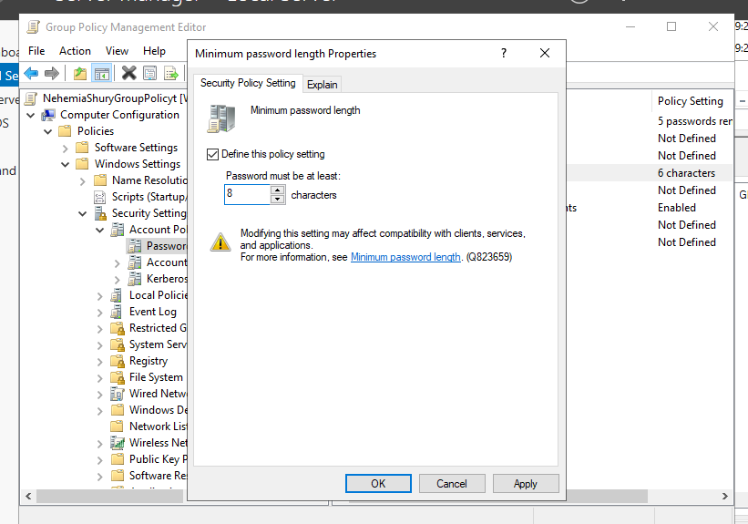
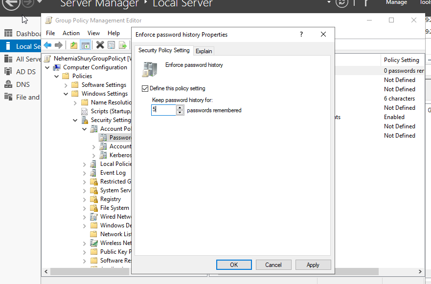
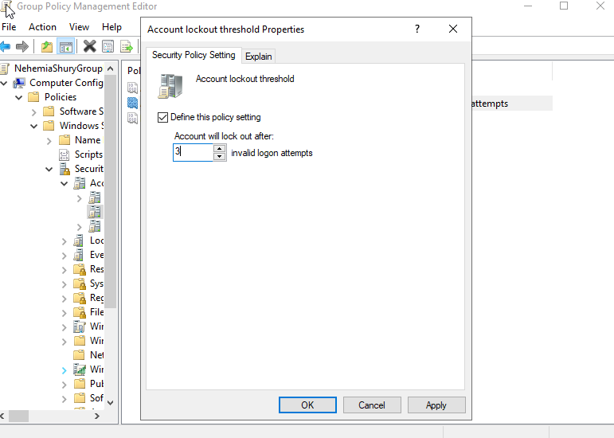
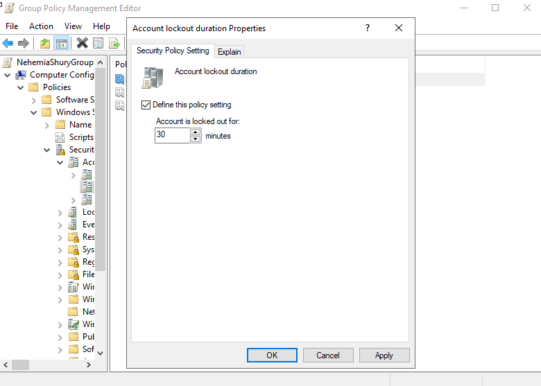
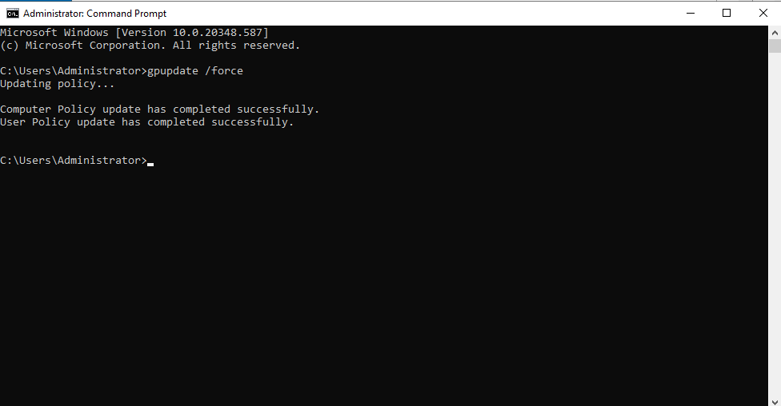
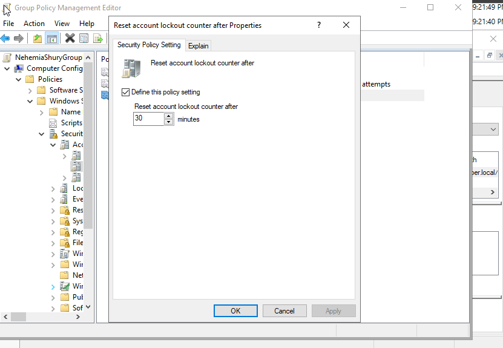
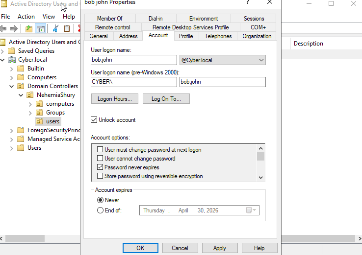

# Lab 06: Password Hardening & Brute Force Protection

## 🎯 Objective
To mitigate credential-based attacks (Brute Force/Dictionary) by enforcing advanced password complexity and implementing automated account lockout thresholds.

## 🛠 Technical Implementation
* **Password Hardening:** Increased minimum length to **8 characters** and enabled **Password History (5)** to prevent credential reuse.
* **Brute Force Protection:** Configured **Account Lockout Policy** to trigger after **3 failed attempts**, with a 30-minute cooling-off period.
* **Identity Recovery:** Demonstrated the administrative "Unlock" procedure within Active Directory Users and Computers (ADUC) to restore user access after a lockout event.

## ⚖️ GRC & Security Connection
* **NIST 800-53 (AC-7):** Unsuccessful Logon Attempts. This lab satisfies the requirement to limit the number of consecutive failed logon attempts.
* **SOC2 / ISO 27001:** These frameworks require proof that an organization has automated mechanisms to prevent unauthorized access via password guessing.

## 📸 Proof of Work

### 1. Hardened Password Policy
Implementing the new security baseline for character length and preventing password reuse.

| Password Length (8) | Password History (5) |
| :--- | :--- |
|  |  |

### 2. Brute Force Protection (Lockout Policy)
Configuring the threshold for failed attempts and the mandatory cooling-off duration.

| Lockout Threshold | Lockout Duration |
| :--- | :--- |
|  |  |

### 3. Enforcement & Validation
Updating the client-side policy and performing a negative test to trigger the account lockout.

| GPUpdate Force | Lockout Error Message |
| :--- | :--- |
|  |  |

### 4. Administrative Recovery
Showing the "Unlock Account" procedure in ADUC to restore access.
