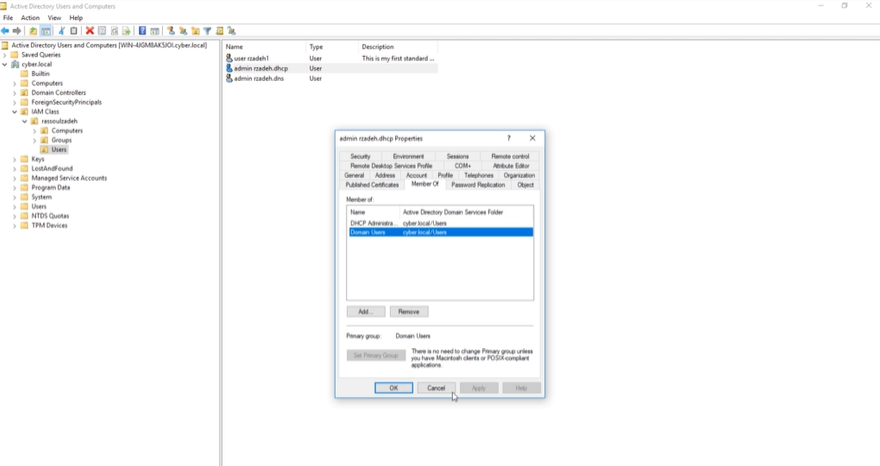
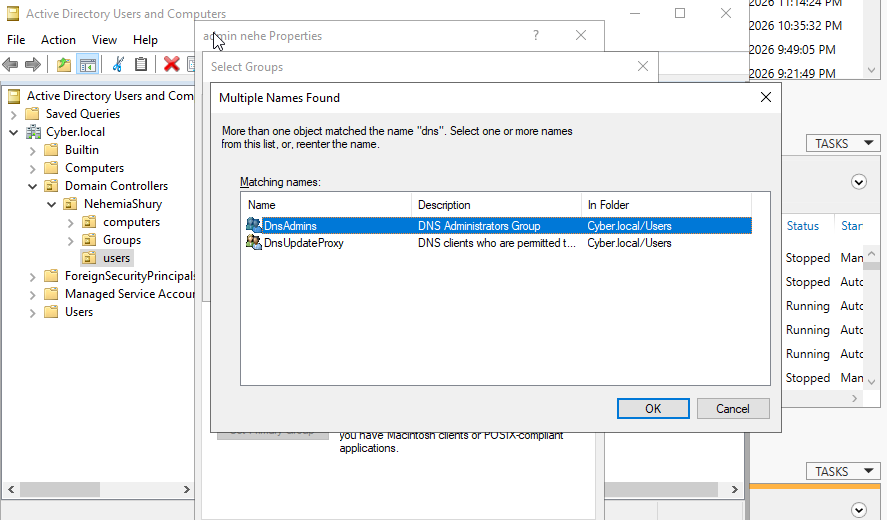
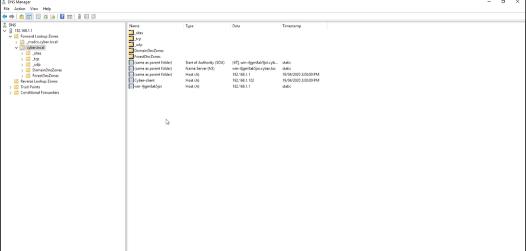
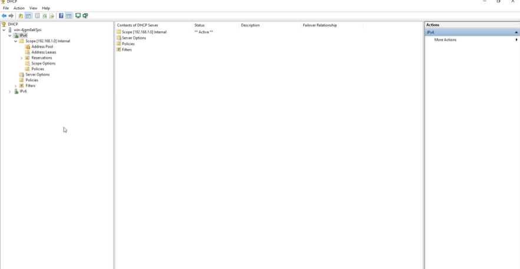

# Lab 07: Principle of Least Privilege (PoLP) & Administrative Tiering

## 🎯 Objective
To implement the Principle of Least Privilege (PoLP) by creating specialized administrative accounts for DNS and DHCP, ensuring that administrative power is restricted to the specific scope of the role.

## 🛠 Technical Implementation
* **Role-Based Provisioning:** Created two distinct administrative identities: `Admin.DNS` and `Admin.DHCP`.
* **Scoped Access Control:** Leveraged built-in Active Directory security groups (**DNSAdmins** and **DHCP Administrators**) to provide functional access without granting broad Domain Admin privileges.
* **Separation of Duties (SoD):** Validated that the DNS Administrator is cryptographically and procedurally blocked from modifying DHCP scopes or creating Directory users.

## ⚖️ GRC & Security Connection
* **NIST 800-53 (AC-6):** Least Privilege. This lab demonstrates the technical enforcement of restricting privileged account access to the minimum necessary for the performance of authorized tasks.
* **Blast Radius Reduction:** By tiering administrative access, a compromise of the DNS Admin account does not lead to a full forest compromise.

## 📸 Proof of Work

### 1. Administrative Group Membership
Assigning the specialized identities to their respective functional groups (**DHCP Administrators** and **DNSAdmins**) to enforce scoped access.

| DHCP Admin Group | DNS Admin Group |
| :--- | :--- |
|  |  |

### 2. Functional Success (Scoped Access)
Validating that each account can perform its designated administrative tasks within the infrastructure.

| DNS Record Creation | DHCP Server Connection |
| :--- | :--- |
|  |  |

### 3. Governance Verification (Access Denied)
*Note: To complete the security audit, ensure you have verified that the DHCP Admin is blocked from DNS tools and vice versa.*