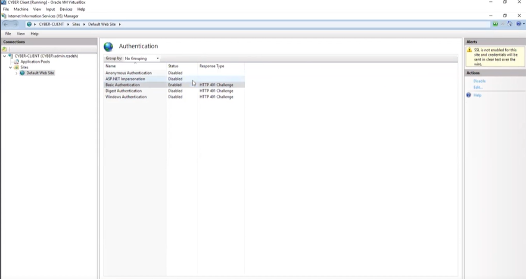
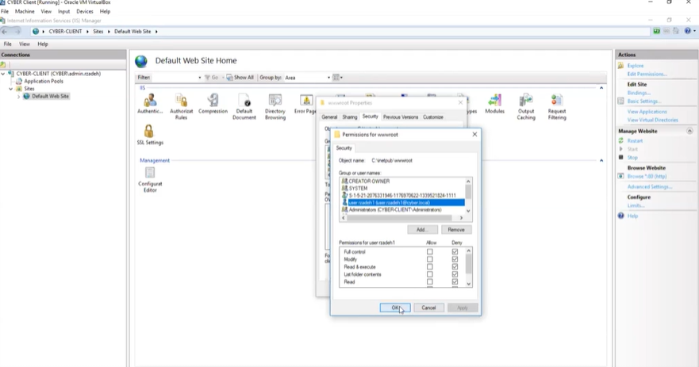

# Lab 09: Web Service Authentication & Authorization (IIS)

## 🎯 Objective
To demonstrate resource-level Identity and Access Management (IAM) by securing a web service through the decommissioning of anonymous access and the enforcement of NTFS-based authorization rules.

## 🛠 Technical Implementation
* **Web Role Deployment:** Provisioned Internet Information Services (IIS) with the Basic Authentication security module.
* **Authentication Hardening:** Disabled Anonymous SID-based access to enforce a mandatory identity handshake for all web requests.
* **Granular Authorization:** Implemented an NTFS "Deny" rule on the web root directory (`C:\inetpub\wwwroot`) for a specific domain user, overriding inherited permissions.
* **Verification:** Confirmed 401.3 (Unauthorized) response codes for the restricted user while maintaining full access for administrative identities.

## ⚖️ GRC & Security Connection
* **NIST 800-53 (AC-3):** Access Enforcement. This lab demonstrates the technical application of approved authorizations for logical access to information and system resources.
* **Identity-Centric Security:** Proves that local resource permissions (NTFS) can be used as a secondary "Gatekeeper" even if a user successfully authenticates at the primary level.

## 📸 Proof of Work

### 1. Authentication Configuration
Showing the transition from Anonymous access to Mandatory Basic Authentication.

### 2. Authorization (Deny Rule)
Evidence of the NTFS security policy used to block a specific user identity.

### 3. Access Verification
| Blocked User (401.3 Error) | Admin User (Success) |
| :--- | :--- |
|  |  |
