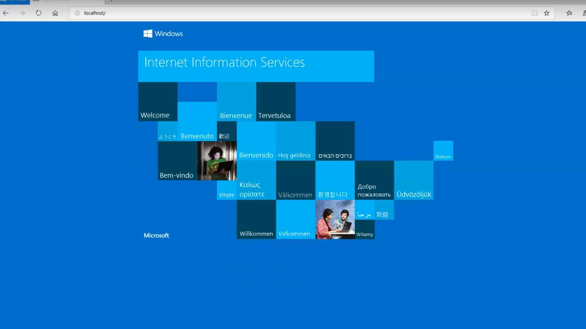
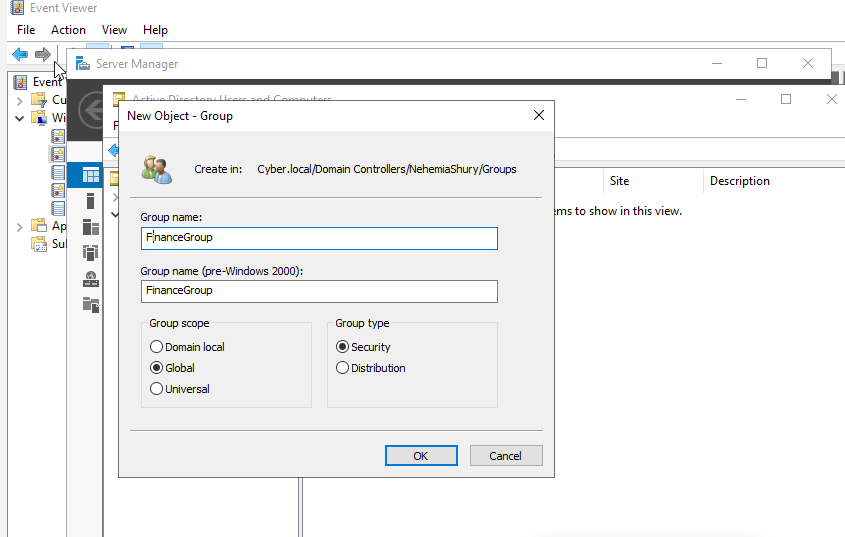
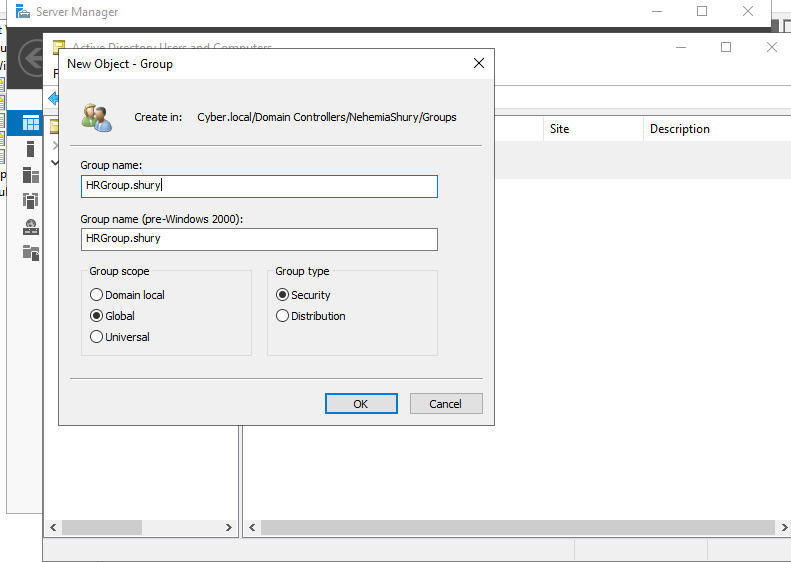
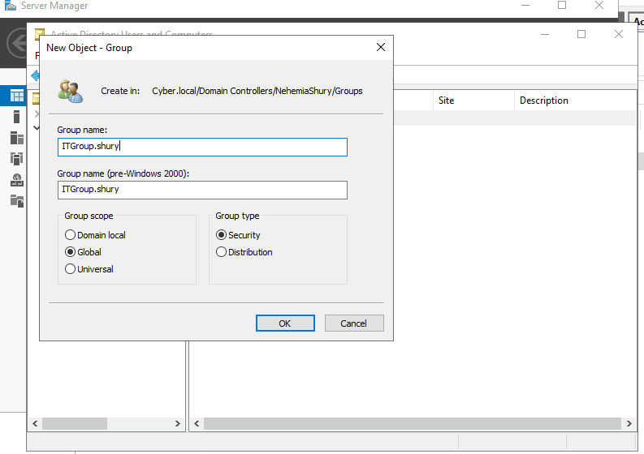
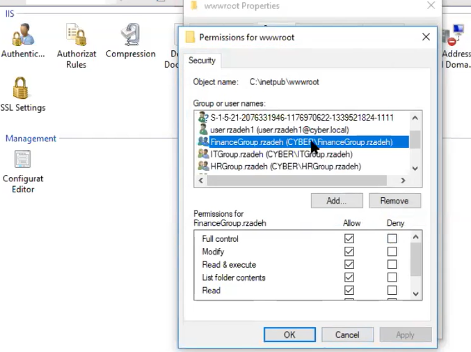
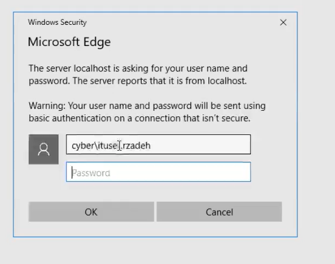

# Lab 10: Multi-Departmental RBAC for Web Services

## 🎯 Objective
To implement an enterprise-grade Role-Based Access Control (RBAC) model using Active Directory Security Groups to govern access to sensitive web resources.

## 🛠 Technical Implementation
* **Organizational Identity Mapping:** Provisioned three departmental groups (`Finance`, `HR`, `IT`) and mapped unique user identities to each.
* **Security Group Nesting:** Leveraged AD Group memberships as the primary authorization mechanism for web resource access.
* **Granular Authorization Policy:** Configured IIS NTFS permissions to follow a "Need-to-Know" baseline:
    * **Finance:** Authorized (Allow)
    * **HR/IT:** Unauthorized (Explicit Deny)
* **Testing Methodology:** Validated the policy via InPrivate browser sessions to bypass credential caching and confirm absolute access denial for non-finance identities.

## ⚖️ GRC & Security Connection
* **NIST 800-53 (AC-3):** Access Enforcement. Demonstrates the capability to restrict resource access based on departmental roles.
* **Principle of Least Privilege (PoLP):** Ensures that users in the IT and HR departments cannot access Finance-specific data, reducing the risk of internal data leaks.
## 📸 Proof of Work

### 1. Directory Group Infrastructure
Establishing the departmental security groups and verifying individual user memberships.

| Master Group View | Finance User | HR User | IT User |
| :--- | :--- | :--- | :--- |
|  |  |  |  |

### 2. Authorization Policy (ACL)
Evidence of the NTFS security policy applied to the web root to enforce Departmental Separation of Duties (SoD).

### 3. Verification Logs
| Finance Success (Authorized) | HR/IT Failure (Denied) |
| :--- | :--- |
|  |  |