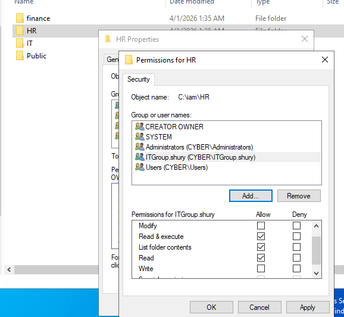
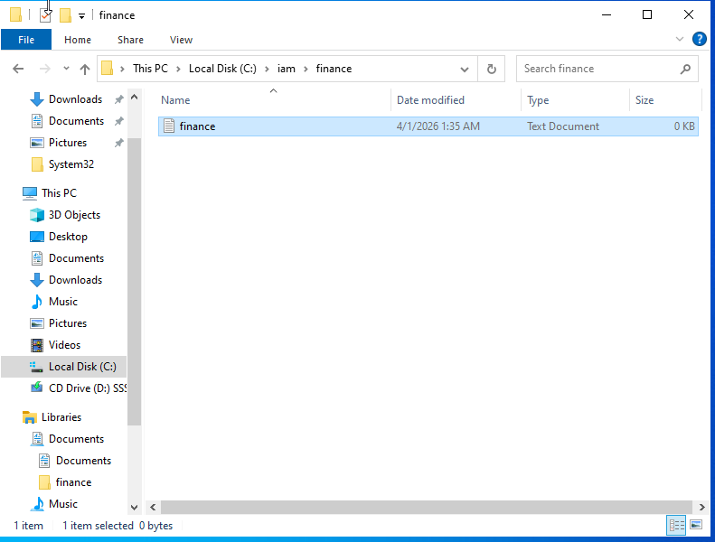

# Lab 12: Advanced NTFS Permissions & Read-Only Governance

## 🎯 Objective
To implement "Read-Only" administrative access across departmental silos, allowing for technical support and auditing while preventing unauthorized data modification or creation.

## 🛠 Technical Implementation
* **Permission Scoping:** Transitioned the `IT_Group` from an explicit 'Deny' state to a 'Read & Execute' state on the Finance and HR directories.
* **Write Protection:** Explicitly withheld 'Modify' and 'Write' permissions to ensure data integrity is maintained during support activities.
* **Role-Based Verification:** Performed cross-account testing to confirm that the IT User can view departmental documentation but is programmatically blocked from altering the file system.

## ⚖️ GRC & Security Connection
* **NIST 800-53 (AC-6):** Least Privilege. Demonstrates that access can be "tiered"—users aren't just allowed or blocked; they are given the exact level of access required for their role.
* **Integrity Controls:** Ensures that "Support" roles do not have the power to create "Shadow Data" or modify "Audit Trails" in sensitive folders.

## 📸 Proof of Work

### 1. Updated Security Configuration
Showing the transition to Read-Only permissions for the IT Group.

### 2. Verification (The Support Audit)
| Success: Opening Finance File | Failure: Creating New File |
| :--- | :--- |
|  |  |
