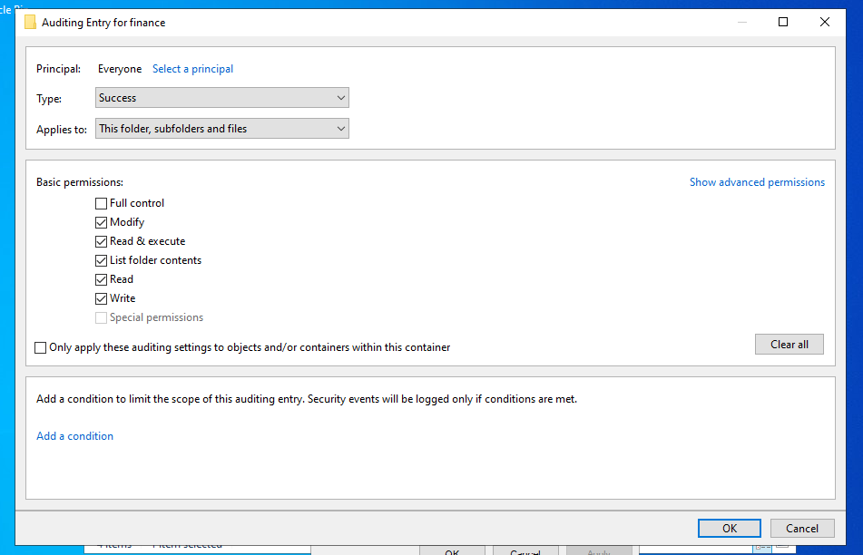
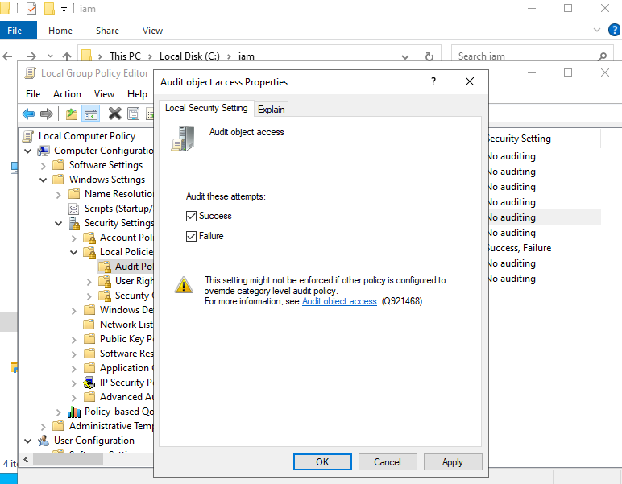
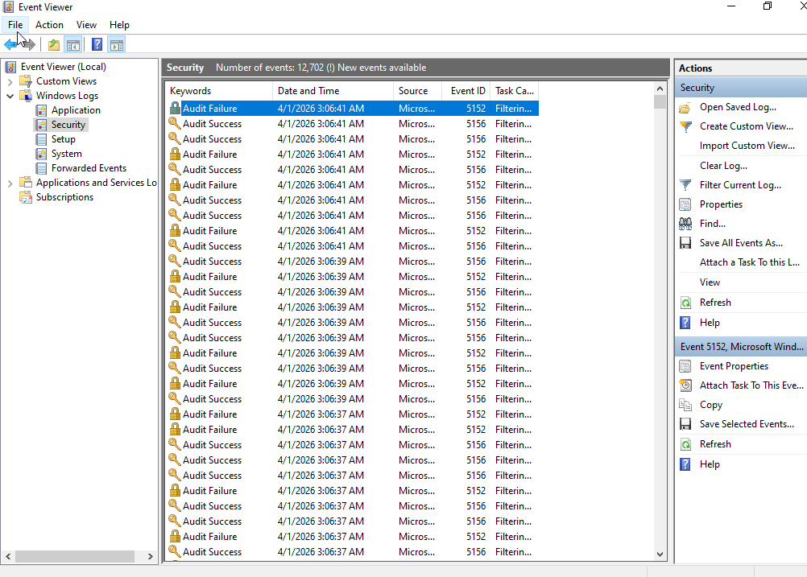

# Lab 13: File System Auditing & Compliance Tracking

## 🎯 Objective
To implement granular object-level auditing to ensure accountability and traceability for sensitive departmental data, aligning with industry compliance standards (SOC2/NIST).

## 🛠 Technical Implementation
* **SACL Configuration:** Established a System Access Control List (SACL) on the Finance directory, targeting the `Everyone` principal to capture all successful and failed access attempts.
* **GPO Audit Enforcement:** Enabled the `Audit object access` security policy via Group Policy to mandate the logging of file-system interactions to the Windows Security Log.
* **Forensic Validation:** Utilized Windows Event Viewer to identify and analyze **Event ID 4663**, confirming the capture of user identity, access time, and specific file interaction.

## ⚖️ GRC & Security Connection
* **NIST 800-53 (AU-2):** Event Logging. This lab demonstrates the technical capability to generate audit records for security-relevant events.
* **Compliance Preparedness:** Essential for **HIPAA** and **SOX** audits, providing the "Proof of Integrity" required to verify that only authorized personnel are interacting with sensitive data.

## 📸 Proof of Work

### 1. Folder Auditing (SACL)
Showing the configuration of the auditing entry for the Finance directory.

### 2. Group Policy Enforcement
Evidence of the 'Audit object access' policy being enabled for Success and Failure.

### 3. Verification (Event Viewer)
The "Audit Receipt" showing a successful log entry for a file access event.

