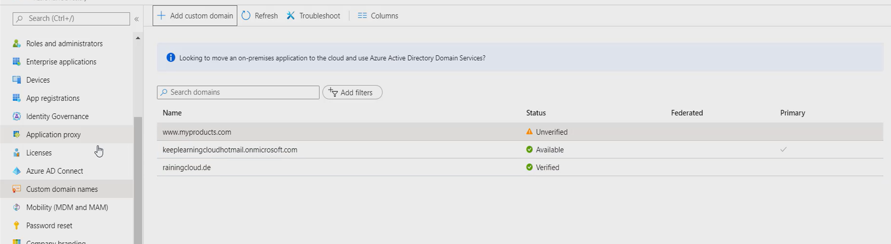
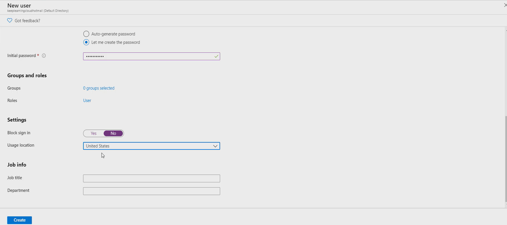
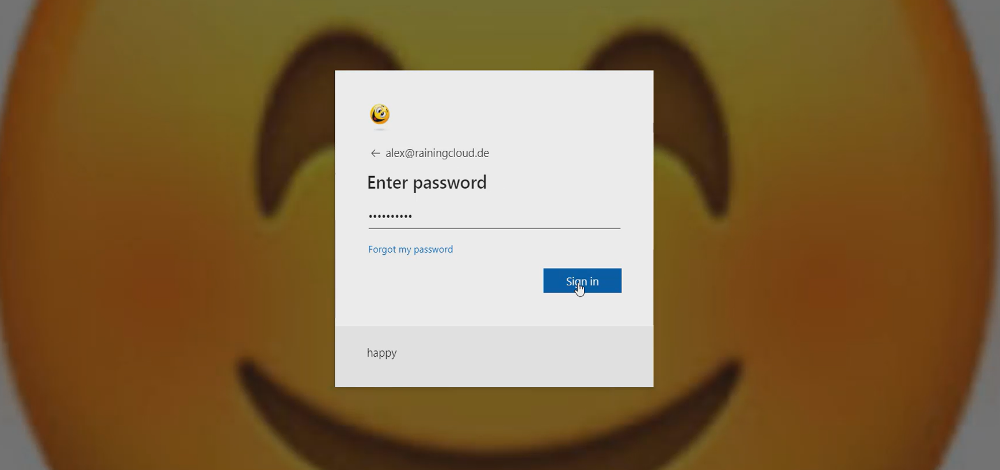

# Lab 15: Cloud Identity Provisioning & Custom Domain Integration

## 🎯 Objective
To transition identity management to the cloud using Microsoft Entra ID, focusing on custom domain verification, geographic security boundaries, and corporate branding for phishing mitigation.

## 🛠 Technical Implementation
* **Namespace Verification:** Verified a custom domain via DNS TXT record integration, moving away from the default `.onmicrosoft.com` tenant suffix.
* **User Lifecycle Management:** Provisioned a staged identity (`Alex@rainingcloudy.com`) with 'Block Sign-in' enabled to simulate pre-onboarding security.
* **Geographic Guardrails:** Configured the 'Usage Location' attribute to establish a baseline for conditional access and geographic login restrictions.
* **Corporate Branding:** Implemented a customized sign-in experience (Logo/Background) to provide a visual trust signal to end-users during authentication.

## ⚖️ GRC & Security Connection
* **NIST 800-53 (IA-2):** Identification and Authentication. Demonstrates the use of organization-defined identity suffixes and branded authentication interfaces.
* **Anti-Phishing Strategy:** Utilizing corporate branding as a "Trust Signal" to train users to identify legitimate organizational portals versus fraudulent credential-harvesting sites.

## 📸 Proof of Work

### 1. Custom Domain Verification
Evidence of the verified status of the organization's custom DNS suffix.

### 2. User Security Attributes
Showing the usage location and sign-in status for the newly provisioned identity.

### 3. Brand Verification (Landing Page)
The customized login interface showing corporate imagery and the "Happy" banner text.

